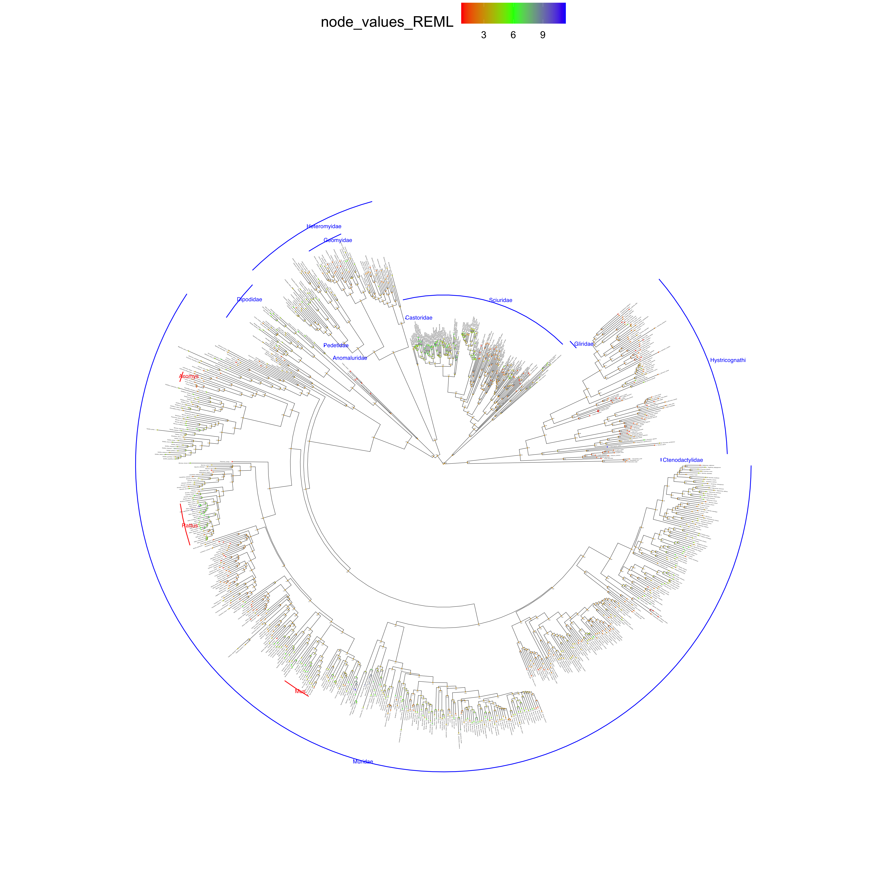
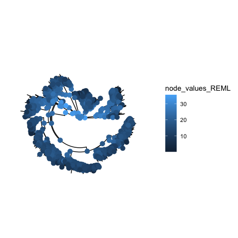
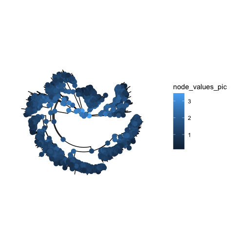

Final Project E\&EB 354
================

## Litter Size Evolution Using Ancestral Character State Reconstruction

## Background

``` 
  Menstruation is the periodic shedding of endometrium decidua in the absence of pregnancy. The endometrium goes through a complex process of decidualization triggered by sequential hormone fluctuations to prepare for pregnancy. However, in most mammals, decidualization is triggered by embryonic signals, and the decidua is reabsorbed in the case of pseudopregnancy. Among the 5000+ eutherian mammals, only a small number of species have been shown to have menstruation. These include most primates, three species of bats, the spiny mouse and the elephant shrew (Catalini and Fedder 2020). 

  Upon closer inspection, some species might have evolved spontaneous decidualization and menstruation independently as suggested by their dispersed distribution on the phylogenetic tree. The fact that menstruation is not necessary for reproduction (most species don’t have it), yet it has evolved multiple times prompts us to investigate the evolutionary significance of spontaneous decidualization and menstruation (Wagner 2020). 

  Multiple hypotheses have been proposed. One argues that spontaneous decidualization allows the female to test the quality of the embryo, which helps the mother to avoid unnecessary investment into defective conceptus and achieves successful pregnancy sooner (Macklon and Brosens 2014). This idea is supported by the fact that known menstruating species all have litter sizes of one or two, with the exception of the spiny mouse (Bellofiore, Ellery et al. 2017, Catalini and Fedder 2020). Smaller litter size might correspond to higher investment into each offspring, and thus the demand for early screening of conceptus quality.  
```

## Hypothesis

    Our hypothesis is that smaller litter size might have evolved together with spontaneous decidualization and menstruation, as the result of a life history strategy to put higher investment per neonate. 

## Methods

``` 
  To test the hypothesis, we decide to trace the litter size evolution for Rodentia using ancestral state reconstruction. Ancestral state reconstruction is the result of applying a hypothetical model of evolution to a given phylogeny. Due to the size of the phylogenetic tree, we are not building the rodent phylogeny from DNA sequence. Instead, the phylogenetic tree used in this project is taken from the consensus mammal tree constructed by Upham et al. using DNA sequence and Bayesian inference. The tree contains 2391 rodent species (Upham, Esselstyn et al. 2019).
  
  The character state collected and inferred is average litter size, defined as number of offspring born per litter per female, either count before birth, at birth or after birth. The pregnant females can be wild, captured or laboratory-raised. Indirect anatomical substitutes like placental scars are not included. The litter size data is mainly taken from PanTheria database and recently published literature retrieved using Google Scholar searches. PanTheria, published in 2008 is a global species-level database of mammal life history traits. It contains 883 average litter size data for 2279 included rodent species (Jones, Bielby et al. 2009). For the unreported species, I searched related literature published after 2008 with Google Scholar and retrieved an additional 123 data points. If multiple entries are collected for the same species, a weighted average is calculated. If the number of litters is not reported, the entries are averaged evenly. In total, the project has collected average litter size for 1006 rodent species.

  Character states data are cleaned in Excel and matched towards taxonomy name file provided by Upham et al. Irrelevant tips are dropped from the phylogenetic tree. In total, 819 species with average litter size data are also included in the consensus tree. Ancestral character state reconstruction for them is performed in R using Ace function from Ape package. Three methods are used: Maximum Likelihood (ML), Residual Maximum Likelihood (REML) and Phylogenetic Independent Contrasts (PIC).  
```

## Results and Discussions:

``` 
  The three methods used generate different ancestral litter size with various degrees of uncertainty. Here is a brief overview of the methods to help our discussion.
ML methods of ancestral character state reconstruction attempts to find the internal node values that will maximize the probability of the observed data given specified model and phylogeny. In our case, Brownian motion is assumed to be the model of evolution, meaning that average litter size evolve randomly, without bias to increase or decrease. Ideally, the litter size at equilibrium should follow a normal distribution with average litter size of μ and a variance of σ² (Royer-Carenzi and Didier 2016). 
  ML method underestimates the true variance of the model. This is because the model used an unknown estimator for the mean, and the expected variance E(σ²) = (n-k / n) σ², where k is the dimensionality of the data and n is the sample size (Royer-Carenzi and Didier 2016). However, ML is suitable for our purpose because our character state is one-dimensional and sample size relatively large. Furthermore, we are more interested in the mean value, not variance. 
  REML is developed to mathematically correct the underestimated variance. It treats the mean as a nuisance parameter and does not contain any information about the mean. 
  PIC is based on the Phylogenetic Independent Contrast method developed by Felsenstein (Felsenstein 1985). PIC calculates the value of an ancestral node by averaging the value of its children, weighted by the branch length. The reconstructed litter size depends only on the descendants. The confidence interval is calculated based on the expected variance of the model, which is derived from the tree (Royer-Carenzi and Didier 2016). 
  Three complete phylogenetic trees are attached at the end of this file. Generally, the root of Rodents has a predicted litter size of 2-3, and evolves either towards a diversifying range, from 1 to 11.3. The major families are labeled according to previous taxonomy (DeBry and Sagel 2001). Larger families, such as Muridae, Heteromyidae, Sciuridae and Hystricognathi include clades of larger litter size and smaller litter size. 
```

## ML

    ## Warning in sqrt(diag(solve(h))): NaNs produced

<!-- -->
Metadata about REML reconstruction:

Residual log-likelihood: -3620.553863

CI95 for ML:

|     | lower bound | upper bound |
| :-- | ----------: | ----------: |
| 820 |    1.640912 |    5.569241 |
| 821 |    1.654606 |    5.555528 |
| 822 |    1.163133 |    6.046221 |
| 823 |    1.577236 |    5.630586 |
| 824 |    1.729779 |    5.480501 |
| 825 |    1.913126 |    5.296268 |
| 826 |    1.928765 |    5.270549 |
| 827 |    1.827166 |    4.456771 |
| 828 |    1.272778 |    1.908321 |
| 829 |    1.838788 |    5.368857 |

sample ML confidence interval

## REML

    ## Warning in sqrt(1/out$hessian): NaNs produced

<!-- -->
Metadata about REML reconstruction:

Residual log-likelihood: -5664.2874262

Sigma2: 997.3621519, NaN

CI95 for REML:

|     | lower bound | upper bound |
| :-- | ----------: | ----------: |
| 820 | \-11.170629 |   16.942259 |
| 821 | \-11.075762 |   16.847165 |
| 822 | \-14.542507 |   20.307337 |
| 823 | \-11.577820 |   17.328727 |
| 824 | \-10.482808 |   16.261825 |
| 825 |  \-9.168933 |   14.914383 |
| 826 |  \-9.050760 |   14.727896 |
| 827 |  \-7.636693 |   11.102322 |
| 828 |  \-1.464976 |    3.070575 |
| 829 |  \-9.671487 |   15.420109 |

sample REML confidence interval

## PIC

<!-- -->

|     | lower bound | upper bound |
| :-- | ----------: | ----------: |
| 820 |   2.0001156 |    3.771613 |
| 821 |   1.8748948 |    4.297813 |
| 822 |   0.8110138 |    4.270835 |
| 823 |   1.7176718 |    3.872031 |
| 824 |   2.4806467 |    4.499565 |
| 825 |   0.7682447 |    2.667815 |
| 826 |   0.7397868 |    2.736672 |
| 827 |   0.3333333 |    1.660659 |
| 828 |   0.8454750 |    1.137609 |
| 829 |   1.1800702 |    3.378577 |

sample PIC confidence interval

## Compare the values by plotting ML and PIC over REML

<!-- --><!-- -->

## confidence interval ML

<!-- -->

## confidence interval REML

<!-- -->

## confidence interval PIC

<!-- -->
