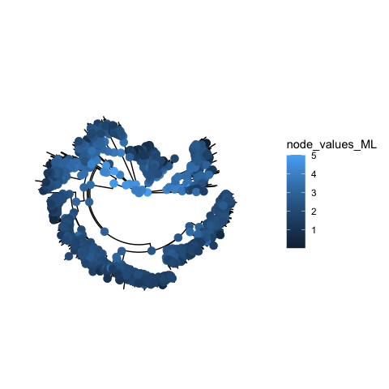

Final Project E\&EB 354
================

## ML

    ## Warning in sqrt(diag(solve(h))): NaNs produced

<!-- -->
Metadata about REML reconstruction:

Residual log-likelihood: -3620.553863

CI95 for ML:

|     | lower bound | upper bound |
| :-- | ----------: | ----------: |
| 820 |    1.640912 |    5.569241 |
| 821 |    1.654606 |    5.555528 |
| 822 |    1.163133 |    6.046221 |
| 823 |    1.577236 |    5.630586 |
| 824 |    1.729779 |    5.480501 |
| 825 |    1.913126 |    5.296268 |
| 826 |    1.928765 |    5.270549 |
| 827 |    1.827166 |    4.456771 |
| 828 |    1.272778 |    1.908321 |
| 829 |    1.838788 |    5.368857 |

sample ML confidence interval

## REML

    ## Warning in sqrt(1/out$hessian): NaNs produced

<!-- -->
Metadata about REML reconstruction:

Residual log-likelihood: -5664.2874262

Sigma2: 997.3621519, NaN

CI95 for REML:

|     | lower bound | upper bound |
| :-- | ----------: | ----------: |
| 820 | \-11.170629 |   16.942259 |
| 821 | \-11.075762 |   16.847165 |
| 822 | \-14.542507 |   20.307337 |
| 823 | \-11.577820 |   17.328727 |
| 824 | \-10.482808 |   16.261825 |
| 825 |  \-9.168933 |   14.914383 |
| 826 |  \-9.050760 |   14.727896 |
| 827 |  \-7.636693 |   11.102322 |
| 828 |  \-1.464976 |    3.070575 |
| 829 |  \-9.671487 |   15.420109 |

sample REML confidence interval

## PIC

<!-- -->

|     | lower bound | upper bound |
| :-- | ----------: | ----------: |
| 820 |   2.0001156 |    3.771613 |
| 821 |   1.8748948 |    4.297813 |
| 822 |   0.8110138 |    4.270835 |
| 823 |   1.7176718 |    3.872031 |
| 824 |   2.4806467 |    4.499565 |
| 825 |   0.7682447 |    2.667815 |
| 826 |   0.7397868 |    2.736672 |
| 827 |   0.3333333 |    1.660659 |
| 828 |   0.8454750 |    1.137609 |
| 829 |   1.1800702 |    3.378577 |

sample PIC confidence interval

## Compare the values by plotting ML and PIC over REML

<!-- --><!-- -->

## confidence interval ML

<!-- -->

## confidence interval REML

<!-- -->

## confidence interval PIC

<!-- -->
