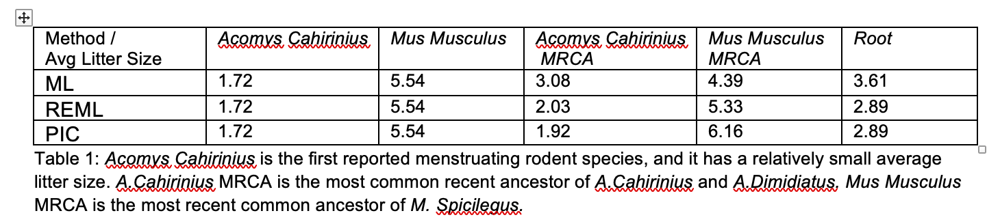

## Litter Size Evolution Using Ancestral Character State Reconstruction 

## Background 
Menstruation is the periodic shedding of endometrium decidua in the absence of pregnancy. The endometrium goes through a complex process of decidualization triggered by sequential hormone fluctuations to prepare for pregnancy. However, in most mammals, decidualization is triggered by embryonic signals, and the decidua is reabsorbed in the case of pseudopregnancy. Among the 5000+ eutherian mammals, only a small number of species have been shown to have menstruation. These include most primates, three species of bats, the spiny mouse and the elephant shrew (Catalini and Fedder 2020). 

Upon closer inspection, some species might have evolved spontaneous decidualization and menstruation independently as suggested by their dispersed distribution on the phylogenetic tree. The fact that menstruation is not necessary for reproduction (most species don’t have it), yet it has evolved multiple times prompts us to investigate the evolutionary significance of spontaneous decidualization and menstruation (Wagner 2020). 
	
Multiple hypotheses have been proposed. One argues that spontaneous decidualization allows the female to test the quality of the embryo, which helps the mother to avoid unnecessary investment into defective conceptus and achieves successful pregnancy sooner (Macklon and Brosens 2014). This idea is supported by the fact that known menstruating species all have litter sizes of one or two, with the exception of the spiny mouse (Bellofiore, Ellery et al. 2017, Catalini and Fedder 2020). Smaller litter size might correspond to higher investment into each offspring, and thus the demand for early screening of conceptus quality.  

## Hypothesis
Our hypothesis is that smaller litter size might have evolved together with spontaneous decidualization and menstruation, as the result of a life history strategy to put higher investment per neonate. 

## Methods
To test the hypothesis, we decide to trace the litter size evolution for Rodentia using ancestral state reconstruction. Ancestral state reconstruction is the result of applying a hypothetical model of evolution to a given phylogeny. Due to the size of the phylogenetic tree, we are not building the rodent phylogeny from DNA sequence. Instead, the phylogenetic tree used in this project is taken from the consensus mammal tree constructed by Upham et al. using DNA sequence and Bayesian inference. The tree contains 2391 rodent species (Upham, Esselstyn et al. 2019).
	  
The character state collected and inferred is average litter size, defined as number of offspring born per litter per female, either count before birth, at birth or after birth. The pregnant females can be wild, captured or laboratory-raised. Indirect anatomical substitutes like placental scars are not included. The litter size data is mainly taken from PanTheria database and recently published literature retrieved using Google Scholar searches. PanTheria, published in 2008 is a global species-level database of mammal life history traits. It contains 883 average litter size data for 2279 included rodent species (Jones, Bielby et al. 2009). For the unreported species, I searched related literature published after 2008 with Google Scholar and retrieved an additional 123 data points. If multiple entries are collected for the same species, a weighted average is calculated. If the number of litters is not reported, the entries are averaged evenly. In total, the project has collected average litter size for 1006 rodent species.
	
Character states data are cleaned in Excel and matched towards taxonomy name file provided by Upham et al. Irrelevant tips are dropped from the phylogenetic tree. In total, 819 species with average litter size data are also included in the consensus tree. Ancestral character state reconstruction for them is performed in R using Ace function from Ape package. Three methods are used: Maximum Likelihood (ML), Residual Maximum Likelihood (REML) and Phylogenetic Independent Contrasts (PIC).  


```{r setup, echo = FALSE, include=FALSE}
knitr::opts_chunk$set(echo = TRUE, warning = FALSE, message = FALSE)

library(ape)
library(ggtree)
library(knitr)
library(phytools)
library(tidyverse)
library(magrittr)
```


```{r, include = FALSE} 
## read in the tree
  tree_global = read.tree('RAxML_bipartitions.result_FIN4_raw_rooted_wBoots_4098mam1out_OK.newick')
  n_tips = length(tree_global$tip.label)
  root_node = tree_global$edge[(!tree_global$edge[,1] %in% tree_global$edge[,2]),1] %>% unique()
  root_age = max( dist.nodes(tree_global)[,root_node] )
  
  label_offset = 0.02 * root_age
  tree_width = 5 * root_age
```

```{r, include = FALSE}
## drop all the non-relevant tips, clean up names, match name  with character order

charstate = read.csv('1128_Completedata.csv') 
charstate
charstate = charstate%>%mutate(Average = as.numeric(Average))

tips <- tree_global$tip.label
tips_short = str_replace(tips, "[A-Z_]+$", "")
tree_global$tip.label = tips_short

tip_names = data.frame(Name_long=tips, Name=tips_short)
charstate %<>% left_join(tip_names)

missing_in_charstate = tree_global$tip.label[! tree_global$tip.label %in% charstate$Name]
 
tree_global = ape::drop.tip(tree_global, missing_in_charstate)

charstate %<>% filter(!is.na(Name_long))

rank <- match( charstate[,1], tree_global$tip.label )

charstate = charstate[match( tree_global$tip.label, charstate[,1] ), ] #the data order matches, checked manually as well.

 if(! all( charstate[,1] ==tree_global$tip.label ) ){
      stop("Error: tip labels and dataframe rows not in same order!")
    }

```

## Results and Discussions: 
The three methods used generate different ancestral litter size with various degrees of uncertainty. Here is a brief overview of the methods to help our discussion.

ML methods of ancestral character state reconstruction attempts to find the internal node values that will maximize the probability of the observed data given specified model and phylogeny. In our case, Brownian motion is assumed to be the model of evolution, meaning that average litter size evolve randomly, without bias to increase or decrease. Ideally, the litter size at equilibrium should follow a normal distribution with average litter size of μ and a variance of σ² (Royer-Carenzi and Didier 2016). 

ML method underestimates the true variance of the model. This is because the model used an unknown estimator for the mean, and the expected variance E(σ²) = (n-k / n) σ², where k is the dimensionality of the data and n is the sample size (Royer-Carenzi and Didier 2016). However, ML is suitable for our purpose because our character state is one-dimensional and sample size relatively large. Furthermore, we are more interested in the mean value, not variance. 

REML is developed to mathematically correct the underestimated variance. It treats the mean as a nuisance parameter and does not contain any information about the mean. 

PIC is based on the Phylogenetic Independent Contrast method developed by Felsenstein (Felsenstein 1985). PIC calculates the value of an ancestral node by averaging the value of its children, weighted by the branch length. The reconstructed litter size depends only on the descendants. The confidence interval is calculated based on the expected variance of the model, which is derived from the tree (Royer-Carenzi and Didier 2016). 

### ML 
```{r, fig.height = 50, fig.width = 50, echo = FALSE}

litter_ancestral_ML = 
  ace(
  charstate$Average, 
  tree_global,
  type = "continuous",
  method = "ML",
  model = "BM"
)

node_values_ML = c(charstate$Average, round(litter_ancestral_ML$ace, digits= 2)) # data structure for plotting the tips

#for clade

MRCA_dipodidae = getMRCA(tree_global, c("Zapus_princeps", "Sicista_tianshanica"))
MRCA_muridae = getMRCA(tree_global, c("Spalax_microphthalmus","Melanomys_caliginosus"))
MRCA_anomaluridae = getMRCA(tree_global, c("Anomalurus_beecrofti", "Idiurus_macrotis"))
MRCA_pedetidae = getMRCA(tree_global, c("Pedetes_capensis", "Pedetes_surdaster"))

MRCA_geomyidae = getMRCA(tree_global, c("Geomys_texensis", "Thomomys_talpoides"))
MRCA_heteromyidae = getMRCA(tree_global, c("Heteromys_oresterus", "Dipodomys_phillipsii"))
MRCA_hystricognathi = getMRCA(tree_global, c("Trichys_fasciculata", "Cavia_tschudii"))
MRCA_castoridae = getMRCA(tree_global, c("Castor_canadensis", "Castor_fiber"))

MRCA_ctenodactylidae = getMRCA(tree_global, c("Ctenodactylus_gundi", "Massoutiera_mzabi"))
MRCA_sciuridae = getMRCA(tree_global, c("Tamiasciurus_mearnsi", "Ratufa_bicolor"))
MRCA_aplodontidae = getMRCA(tree_global, c("Aplodontia_rufa", "Aplodontia_rufa"))
MRCA_gliridae = getMRCA(tree_global, c("Glirulus_japonicus", "Dryomys_nitedula"))

#for highlight
MRCA_acomys = getMRCA(tree_global, c("Acomys_cahirinus", "Acomys_spinosissimus"))
MRCA_mus = getMRCA(tree_global, c("Mus_pahari", "Mus_tenellus"))
MRCA_rattus = getMRCA(tree_global, c("Rattus_exulans", "Rattus_praetor"))


globaltree_ML = ggtree(tree_global, layout = 'circular' ) + 
  geom_tiplab( fontface = "italic", size= 1.5, offset = 0.005) + 
  xlim(0, 1.2) + 
  geom_text2(aes(label = node_values_ML), nudge_x = 0.005, size = 1.5) +
  geom_tippoint(aes(color=node_values_ML), size= 1.5, alpha= 0.8 ) + 
  geom_nodepoint( aes(color=node_values_ML), size= 1.5, alpha= 0.8 ) + 
  scale_color_gradientn(colours = rainbow(3)) +
  theme(legend.text=element_text(size= 40),
        legend.title=element_text(size=60),
        legend.key.size= unit(3,"cm"), 
        legend.position= "top") + 
  geom_cladelabel(node=MRCA_muridae, label="Muridae", offset = 0.05, fontsize = 8, color = "blue", barsize = 1.5) + 
  geom_cladelabel(node=MRCA_dipodidae, label="Dipodidae", offset = 0.1, fontsize = 8, color = "blue",barsize = 1.5) + 
  geom_cladelabel(node=MRCA_anomaluridae, label="Anomaluridae", offset = 0.1, fontsize = 8, color = "blue", barsize = 1.5 ) +
  geom_cladelabel(node=MRCA_pedetidae, label="Pedetidae", offset = 0.12, fontsize = 8, color = "blue", barsize = 1.5 ) +
  
  geom_cladelabel(node=MRCA_heteromyidae, label="Heteromyidae", offset = 0.1, fontsize = 8, color = "blue", barsize = 1.5 ) +
  geom_cladelabel(node=MRCA_geomyidae, label="Geomyidae", offset = 0.05, fontsize = 8, color = "blue", barsize = 1.5 ) +
  geom_cladelabel(node=MRCA_hystricognathi, label="Hystricognathi", offset = 0.1, fontsize = 8, color = "blue", barsize = 1.5) + 
  geom_cladelabel(node=MRCA_sciuridae, label="Sciuridae", offset = 0.1, fontsize = 8, color = "blue", barsize = 1.5) + 
  geom_cladelabel(node=MRCA_gliridae, label="Gliridae", offset = 0.1, fontsize = 8, color = "blue", barsize = 1.5) + 
  geom_cladelabel(node=MRCA_castoridae, label="Castoridae", offset = 0.1, fontsize = 8, color = "blue", barsize = 1.5) + 
  geom_cladelabel(node=MRCA_ctenodactylidae, label="Ctenodactylidae", offset = 0.1, fontsize = 8, color = "blue", barsize = 1.5) + 
  
  geom_cladelabel(node=MRCA_acomys, label="Acomys", offset = 0.02, fontsize = 8, color = "red", barsize = 1.5) + 
  geom_cladelabel(node=MRCA_mus, label="Mus", offset = 0.02, fontsize = 8, color = "red", barsize = 1.5) + 
  geom_cladelabel(node=MRCA_rattus, label="Rattus", offset = 0.02, fontsize = 8, color = "red", barsize = 1.5) 

globaltree_ML

```
Residual log-likelihood: `r litter_ancestral_ML$loglik`
Given the number of species included, the log-likelihood is reasonable. 

CI95 for ML:
```{r echo = FALSE} 
kable(litter_ancestral_ML$CI95[1:10, ], col.names = c('lower bound', 'upper bound'), caption = "sample ML confidence interval") 
```


### REML 
```{r, fig.height = 50, fig.width = 50, echo = FALSE}

litter_ancestral_REML = 
  ace(
  charstate$Average, 
  tree_global,
  type = "continuous",
  method = "REML",
  model = "BM"
)

node_values_REML = c(charstate$Average, round(litter_ancestral_REML$ace, digits= 2)) # datastructure for plotting the tips

#for clade

MRCA_dipodidae = getMRCA(tree_global, c("Zapus_princeps", "Sicista_tianshanica"))
MRCA_muridae = getMRCA(tree_global, c("Spalax_microphthalmus","Melanomys_caliginosus"))
MRCA_anomaluridae = getMRCA(tree_global, c("Anomalurus_beecrofti", "Idiurus_macrotis"))
MRCA_pedetidae = getMRCA(tree_global, c("Pedetes_capensis", "Pedetes_surdaster"))

MRCA_geomyidae = getMRCA(tree_global, c("Geomys_texensis", "Thomomys_talpoides"))
MRCA_heteromyidae = getMRCA(tree_global, c("Heteromys_oresterus", "Dipodomys_phillipsii"))
MRCA_hystricognathi = getMRCA(tree_global, c("Trichys_fasciculata", "Cavia_tschudii"))
MRCA_castoridae = getMRCA(tree_global, c("Castor_canadensis", "Castor_fiber"))

MRCA_ctenodactylidae = getMRCA(tree_global, c("Ctenodactylus_gundi", "Massoutiera_mzabi"))
MRCA_sciuridae = getMRCA(tree_global, c("Tamiasciurus_mearnsi", "Ratufa_bicolor"))
MRCA_aplodontidae = getMRCA(tree_global, c("Aplodontia_rufa", "Aplodontia_rufa"))
MRCA_gliridae = getMRCA(tree_global, c("Glirulus_japonicus", "Dryomys_nitedula"))

#for highlight
MRCA_acomys = getMRCA(tree_global, c("Acomys_cahirinus", "Acomys_spinosissimus"))
MRCA_mus = getMRCA(tree_global, c("Mus_pahari", "Mus_tenellus"))
MRCA_rattus = getMRCA(tree_global, c("Rattus_exulans", "Rattus_praetor"))


globaltree_REML = ggtree(tree_global, layout = 'circular' ) + 
  geom_tiplab( fontface = "italic", size= 1.5, offset = 0.005) + 
  xlim(0, 1.2) + 
  geom_text2(aes(label = node_values_REML), nudge_x = 0.005, size = 1.5) +
  geom_tippoint(aes(color=node_values_REML), size= 1.5, alpha= 0.8 ) + 
  geom_nodepoint( aes(color=node_values_REML), size= 1.5, alpha= 0.8 ) + 
  scale_color_gradientn(colours = rainbow(3)) +
  theme(legend.text=element_text(size= 40),
        legend.title=element_text(size=60),
        legend.key.size= unit(3,"cm"), 
        legend.position= "top") + 
  geom_cladelabel(node=MRCA_muridae, label="Muridae", offset = 0.05, fontsize = 8, color = "blue", barsize = 1.5) + 
  geom_cladelabel(node=MRCA_dipodidae, label="Dipodidae", offset = 0.1, fontsize = 8, color = "blue",barsize = 1.5) + 
  geom_cladelabel(node=MRCA_anomaluridae, label="Anomaluridae", offset = 0.1, fontsize = 8, color = "blue", barsize = 1.5 ) +
  geom_cladelabel(node=MRCA_pedetidae, label="Pedetidae", offset = 0.12, fontsize = 8, color = "blue", barsize = 1.5 ) +
  
  geom_cladelabel(node=MRCA_heteromyidae, label="Heteromyidae", offset = 0.1, fontsize = 8, color = "blue", barsize = 1.5 ) +
  geom_cladelabel(node=MRCA_geomyidae, label="Geomyidae", offset = 0.05, fontsize = 8, color = "blue", barsize = 1.5 ) +
  geom_cladelabel(node=MRCA_hystricognathi, label="Hystricognathi", offset = 0.1, fontsize = 8, color = "blue", barsize = 1.5) + 
  geom_cladelabel(node=MRCA_sciuridae, label="Sciuridae", offset = 0.1, fontsize = 8, color = "blue", barsize = 1.5) + 
  geom_cladelabel(node=MRCA_gliridae, label="Gliridae", offset = 0.1, fontsize = 8, color = "blue", barsize = 1.5) + 
  geom_cladelabel(node=MRCA_castoridae, label="Castoridae", offset = 0.1, fontsize = 8, color = "blue", barsize = 1.5) + 
  geom_cladelabel(node=MRCA_ctenodactylidae, label="Ctenodactylidae", offset = 0.1, fontsize = 8, color = "blue", barsize = 1.5) + 
  
  geom_cladelabel(node=MRCA_acomys, label="Acomys", offset = 0.02, fontsize = 8, color = "red", barsize = 1.5) + 
  geom_cladelabel(node=MRCA_mus, label="Mus", offset = 0.02, fontsize = 8, color = "red", barsize = 1.5) + 
  geom_cladelabel(node=MRCA_rattus, label="Rattus", offset = 0.02, fontsize = 8, color = "red", barsize = 1.5) 

globaltree_REML

```
Residual log-likelihood: `r litter_ancestral_REML$resloglik` 

CI95 for REML:
```{r echo = FALSE} 
kable(litter_ancestral_REML$CI95[1:10, ], col.names = c('lower bound', 'upper bound'), caption = "sample REML confidence interval") 
```
### PIC

```{r,  fig.height = 50, fig.width = 50, echo = FALSE}
##### The following are for pic method, not sure to include or not

litter_ancestral_pic =
  ace(
  charstate$Average,
  tree_global,
  type = "continuous",
  method = "pic",
  model = "BM"
)

node_values_pic = c(charstate$Average, round(litter_ancestral_pic$ace, digits= 2))

globaltree_pic = ggtree(tree_global, layout = 'circular' ) +
  geom_tiplab( fontface = "italic", size= 1.5, offset = 0.01) +
  xlim(0, 1.2) +
  geom_text2(aes(label = node_values_pic), nudge_x = 0.01, size = 1.5) +
  geom_tippoint(aes(color=node_values_pic), size= 1.5, alpha= 0.8 ) +
  geom_nodepoint( aes(color=node_values_pic), size= 1.5, alpha= 0.8 ) +
  scale_color_gradientn(colours = rainbow(3)) +
  theme(legend.text=element_text(size= 40),
        legend.title=element_text(size=60),
        legend.key.size= unit(3,"cm"),
        legend.position= "top") +
  geom_cladelabel(node=MRCA_muridae, label="Muridae", offset = 0.05, fontsize = 8, color = "blue", barsize = 1.5) +
  geom_cladelabel(node=MRCA_dipodidae, label="Dipodidae", offset = 0.1, fontsize = 8, color = "blue",barsize = 1.5) +
  geom_cladelabel(node=MRCA_anomaluridae, label="Anomaluridae", offset = 0.1, fontsize = 8, color = "blue", barsize = 1.5 ) +
  geom_cladelabel(node=MRCA_pedetidae, label="Pedetidae", offset = 0.12, fontsize = 8, color = "blue", barsize = 1.5 ) +

  geom_cladelabel(node=MRCA_heteromyidae, label="Heteromyidae", offset = 0.1, fontsize = 8, color = "blue", barsize = 1.5 ) +
  geom_cladelabel(node=MRCA_hystricognathi, label="Hystricognathi", offset = 0.1, fontsize = 8, color = "blue", barsize = 1.5) +
  geom_cladelabel(node=MRCA_sciuridae, label="Sciuridae", offset = 0.1, fontsize = 8, color = "blue", barsize = 1.5) +
  geom_cladelabel(node=MRCA_gliridae, label="Gliridae", offset = 0.1, fontsize = 8, color = "blue", barsize = 1.5) +
  geom_cladelabel(node=MRCA_castoridae, label="Castoridae", offset = 0.1, fontsize = 8, color = "blue", barsize = 1.5) +
  geom_cladelabel(node=MRCA_ctenodactylidae, label="Ctenodactylidae", offset = 0.1, fontsize = 8, color = "blue", barsize = 1.5) +

  geom_cladelabel(node=MRCA_acomys, label="Acomys", offset = 0.02, fontsize = 8, color = "red", barsize = 1.5) +
  geom_cladelabel(node=MRCA_mus, label="Mus", offset = 0.02, fontsize = 8, color = "red", barsize = 1.5) +
  geom_cladelabel(node=MRCA_rattus, label="Rattus", offset = 0.02, fontsize = 8, color = "red", barsize = 1.5)


globaltree_pic

```
```{r echo = FALSE } 
kable(litter_ancestral_pic$CI95[1:10, ], col.names = c('lower bound', 'upper bound'), caption = "sample PIC confidence interval") 
```

Three complete phylogenetic trees are shown above. Generally, the root of Rodents has a predicted litter size of 2-3, and evolves either towards a diversifying range, from 1 to 11.3. The major families are labeled according to previous taxonomy (DeBry and Sagel 2001). Larger families, such as Muridae, Heteromyidae, Sciuridae and Hystricognathi include clades of larger litter size and smaller litter size. 



As shown in Table 1, the inferred ancestral character state can be quite different depending on the reconstruction method used. 

## Compare the values by plotting ML and PIC over REML
```{r,fig.height = 3, fig.width = 3 ,echo = FALSE} 

A_methods = data.frame(
  pic = litter_ancestral_pic$ace, 
  reml = litter_ancestral_REML$ace
)

A_methods$node = seq(1:nrow(A_methods)) + n_tips
A_methods %>%
  ggplot(aes(x = reml ,y = pic)) +
  geom_point() +
  geom_abline(slope = 1, intercept = 0, color = "blue") +  coord_equal(xlim=c(0, 10),ylim=c(0, 10))

B_methods = data.frame(
  ml = litter_ancestral_ML$ace, 
  reml = litter_ancestral_REML$ace
)

B_methods$node = seq(1:nrow(A_methods)) + n_tips
B_methods %>%
  ggplot(aes(x = reml,y = ml)) +
  geom_point() +
  geom_abline(slope = 1, intercept = 0, color = "blue") +  coord_equal(xlim=c(0, 10),ylim=c(0, 10))

```

The two plots above show that PIC predictions give a wider range of litter size, which can be explained by the fact that PIC estimates internal node value based only on its two children. REML and ML give similar predicted average litter size.  

### Confidence interval ML
```{r, fig.height = 5, fig.width = 5 ,echo = FALSE}

interval_width_ML = litter_ancestral_ML$CI95[,2] - litter_ancestral_ML$CI95[,1]

node_values_ML = c( rep(NA, nrow(charstate)), interval_width_ML)

intervaltree_ML = ggtree(tree_global, layout = 'circular') + 
  geom_nodepoint(  aes(color=node_values_ML), size=3, alpha=1 )

intervaltree_ML
```

### Confidence interval REML
```{r, fig.height = 5, fig.width = 5 ,echo = FALSE}

interval_width_REML = litter_ancestral_REML$CI95[,2] - litter_ancestral_REML$CI95[,1]

node_values_REML = c( rep(NA, nrow(charstate)), interval_width_REML)

intervaltree_REML = ggtree(tree_global, layout = 'circular') + 
  geom_nodepoint(  aes(color=node_values_REML), size=3, alpha=1 )

intervaltree_REML
```

### Confidence interval PIC
```{r, fig.height = 5, fig.width = 5 , echo = FALSE}
interval_width_pic = litter_ancestral_pic$CI95[,2] - litter_ancestral_pic$CI95[,1]

node_values_pic = c( rep(NA, nrow(charstate)), interval_width_pic )

intervaltree_pic = ggtree(tree_global, layout = 'circular') + 
  geom_nodepoint(  aes(color=node_values_pic), size=3, alpha=1 )

intervaltree_pic
```

The three above confidence interval plots corroborates with our expectation -- the further back in time, the larger the uncertainty. However, REML gives significantly higher uncertainty level, which could be explained by its mathematical setup -- to avoid using unknown mean value and gives a more accurate variance range. 

## Conclusions and Thoughts: 

Previously we guessed that Rodentia would start with ancestors with large litter size and move towards higher investment per neonate with smaller litter size. The ancestral character state reconstruction reveals another pattern -- litter size starts around 2-3, and gradually becomes smaller or larger. The result does not endorse or disprove our hypothesis. It points towards potential clades of interests for further physiological studies.  

Limitation: 

1. Because the species are not uniformly sampled, the constructed ancestor value is biased towards reported data. The more studied clades will have more accurate predicted litter sizes. 

2. The average litter size collection process is very patched. Depending on the source and species, the number of litters can range from 2 to dozens. While higher litters certainly give better averages, I included the rest in order to generate a more complete tree. Furthermore, there is a large variability in litter size depending on living environment and season, which are not accounted for. 

## Reference

Bellofiore, N., et al. (2017). "First evidence of a menstruating rodent: the spiny mouse (Acomys cahirinus)." American Journal of Obstetrics and Gynecology 216(1): 40. e41-40. e11.
	
Catalini, L. and J. Fedder (2020). "Characteristics of the endometrium in menstruating species: lessons learned from the animal kingdom." Biology of Reproduction 102(6): 1160-1169.
	
DeBry, R. W. and R. M. Sagel (2001). "Phylogeny of Rodentia (Mammalia) inferred from the nuclear-encoded gene IRBP." Molecular phylogenetics and evolution 19(2): 290-301.
	
Felsenstein, J. (1985). "Phylogenies and the comparative method." The American Naturalist 125(1): 1-15.
	
Jones, K. E., et al. (2009). "PanTHERIA: a species‐level database of life history, ecology, and geography of extant and recently extinct mammals: Ecological Archives E090‐184." Ecology 90(9): 2648-2648.
	
Macklon, N. S. and J. J. Brosens (2014). "The human endometrium as a sensor of embryo quality." Biology of Reproduction 91(4): 98, 91-98.
	
Royer-Carenzi, M. and G. Didier (2016). "A comparison of ancestral state reconstruction methods for quantitative characters." Journal of theoretical biology 404: 126-142.
	
Upham, N. S., et al. (2019). "Inferring the mammal tree: Species-level sets of phylogenies for questions in ecology, evolution, and conservation." PLoS biology 17(12): e3000494.
	
Wagner, G (2020). “The Evolutionary History of Menstruation.” American Journal of Obstetrics and Gynecology (in press).


