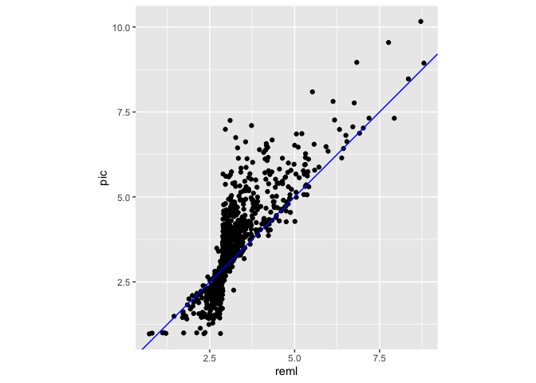
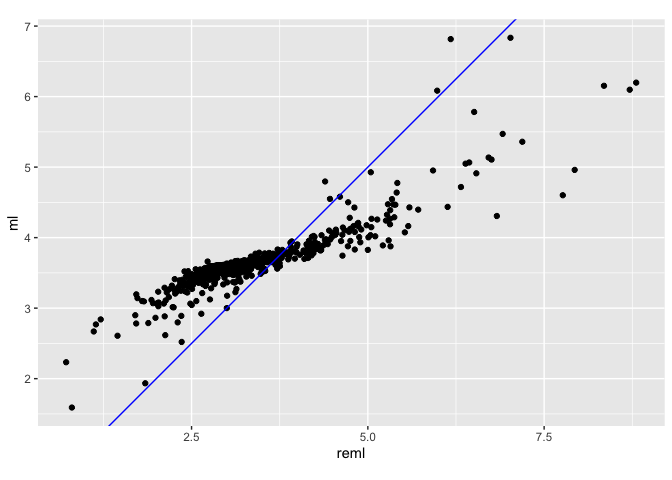

ML\_only
================

## Results and Discussions:

The three methods used generate different ancestral litter size with
various degrees of uncertainty. Here is a brief overview of the methods
to help our discussion.

ML methods of ancestral character state reconstruction attempts to find
the internal node values that will maximize the probability of the
observed data given specified model and phylogeny. In our case, Brownian
motion is assumed to be the model of evolution, meaning that average
litter size evolve randomly, without bias to increase or decrease.
Ideally, the litter size at equilibrium should follow a normal
distribution with average litter size of μ and a variance of σ²
(Royer-Carenzi and Didier 2016).

ML method underestimates the true variance of the model. This is because
the model used an unknown estimator for the mean, and the expected
variance E(σ²) = (n-k / n) σ², where k is the dimensionality of the data
and n is the sample size (Royer-Carenzi and Didier 2016). However, ML is
suitable for our purpose because our character state is one-dimensional
and sample size relatively large. Furthermore, we are more interested in
the mean value, not variance.

REML is developed to mathematically correct the underestimated variance.
It treats the mean as a nuisance parameter and does not contain any
information about the mean.

PIC is based on the Phylogenetic Independent Contrast method developed
by Felsenstein (Felsenstein 1985). PIC calculates the value of an
ancestral node by averaging the value of its children, weighted by the
branch length. The reconstructed litter size depends only on the
descendants. The confidence interval is calculated based on the expected
variance of the model, which is derived from the tree (Royer-Carenzi and
Didier 2016).

Three complete phylogenetic trees are attached at the end of this file.
Generally, the root of Rodents has a predicted litter size of 2-3, and
evolves either towards a diversifying range, from 1 to 11.3. The major
families are labeled according to previous taxonomy (DeBry and Sagel
2001). Larger families, such as Muridae, Heteromyidae, Sciuridae and
Hystricognathi include clades of larger litter size and smaller litter
size.

    ## Warning in sqrt(diag(solve(h))): NaNs produced

    ## Warning in sqrt(1/out$hessian): NaNs produced

Plotting various data
<!-- -->

<!-- -->
